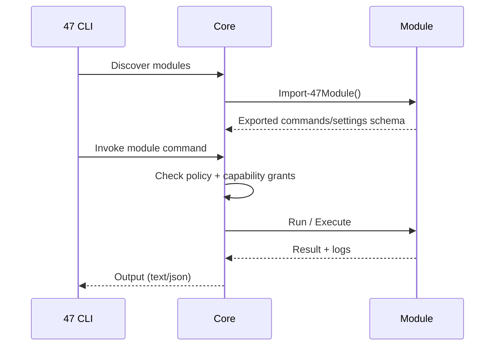

# Module Lifecycle Sequence (Mermaid)

```mermaid
sequenceDiagram
  participant CLI as 47 CLI
  participant Core as Core
  participant Mod as Module
  CLI->>Core: Discover modules
  Core->>Mod: Import-47Module()
  Mod-->>Core: Exported commands/settings schema
  CLI->>Core: Invoke module command
  Core->>Core: Check policy + capability grants
  Core->>Mod: Run / Execute
  Mod-->>Core: Result + logs
  Core-->>CLI: Output (text/json)
```
